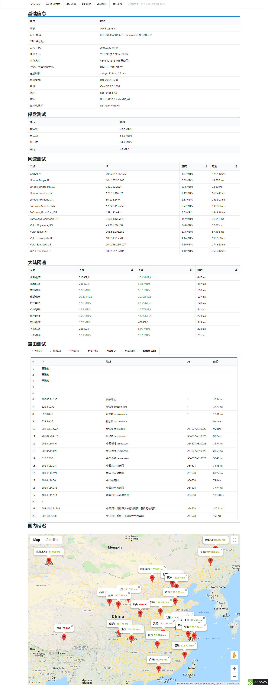

# ZBench-修改自用版-脚本

## 说明

感觉这个脚本挺好用的，可以在线查看评测报告，不过原作者的域名已经失效，无法在线查看。搭建了一个在线服务，修改了一下脚本。又可以在线查看测试结果了。
本地生成报告太复杂，懒得做。

## 脚本命令

中文版：

    wget -N --no-check-certificate https://github.com/FlyxFly/ZBench/raw/master/ZBench-CN.sh
    
## 效果图

## 引用

* Bench.sh ( [https://teddysun.com/444.html](https://teddysun.com/444.html) )
* SuperBench ( [https://www.oldking.net/350.html](https://www.oldking.net/350.html) )
* python实现ping程序 ( [https://www.s0nnet.com/archives/python-icmp](https://www.s0nnet.com/archives/python-icmp) )
* Python 设置颜色 ( [http://www.pythoner.com/357.html](http://www.pythoner.com/357.html) )
* Kirito's Blog ( [https://www.ixh.me](https://www.ixh.me) )